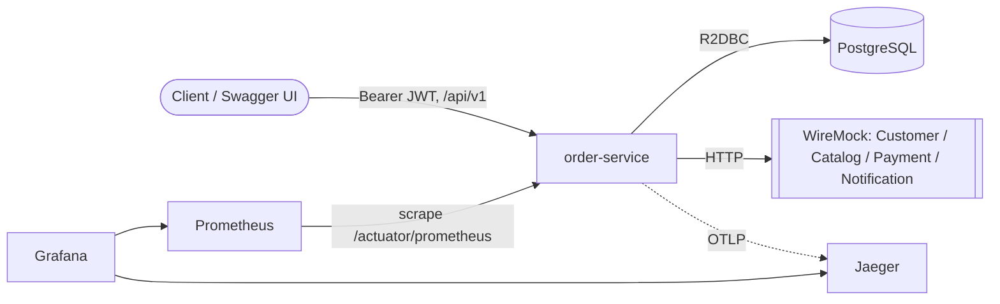
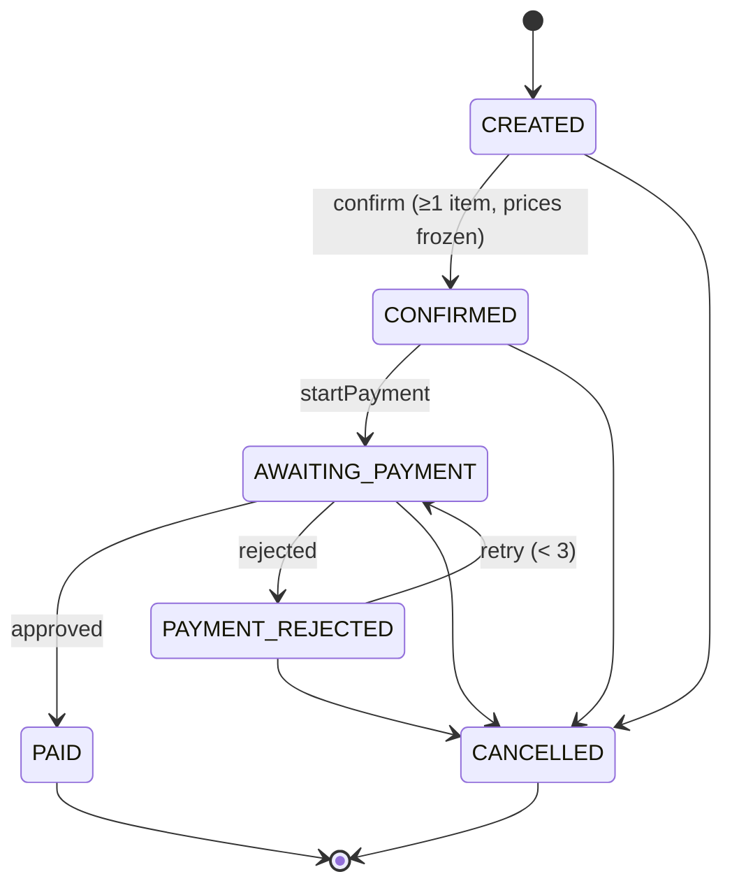
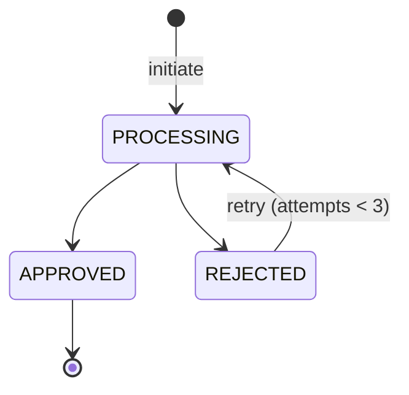

# Architecture Overview

`order-service` is the only real service of the platform; Customer, Catalog, Payment Gateway and
Notification are simulated by a standalone **WireMock** server and called over real HTTP (no stub
logic lives in production code). The service is a reactive **Spring Boot (WebFlux + R2DBC)**
application following **Clean/Hexagonal Architecture** and DDD, persisting to **PostgreSQL** with
Flyway migrations. It exposes a versioned REST API (`/api/v1`, RFC 7807 errors, OpenAPI 3.1),
secured as an OAuth2 Resource Server, and is observable via structured logs, Prometheus metrics and
OpenTelemetry traces.

This document reflects the code as implemented. Apart from `docs/architecture.md` itself (this
file), no mandatory requirement is unmet. Intentional, spec-allowed adaptations: versioned routes;
`DELETE /orders/{orderId}/items/{itemId}` treats `itemId` as the product id (items are keyed by
product, quantities merge); the payment webhook requires the `payments:write` scope; a **dev-only**
token endpoint is provided for evaluation; rate limiting is in-memory per instance.

# Requirements Traceability

| Requirement (desafio.md) | Implementation |
|---|---|
| Order always tied to an existing, **active** customer | `CreateOrder` → `CustomerHttpClient` (GET `/customers/{id}`); `CustomerBlocked/NotFound` |
| **At most one active order** per customer | Partial unique index `uq_active_order_per_customer` (V2) + `existsActiveByCustomerId` |
| Confirmation requires **≥1 item** | `Order.confirm` → `EmptyOrderException` |
| Confirmed order: items **immutable**; cancelled: no changes | `Order.requireModifiable` / `OrderStatus.acceptsItems` |
| Total from product price **at confirmation time** | `ConfirmOrder.currentPrices` (Catalog) → `Order.confirm(prices)` |
| Cancel only **before payment approved** | `OrderStatus` transitions (no `PAID → CANCELLED`) |
| Item: product exists & available; qty > 0; same product **increments** | `AddItem` + `CatalogHttpClient`; `Quantity`; `Order.addItem` |
| Remove non-existent item is an error | `Order.removeItem` → `ItemNotFoundException` |
| Only a **confirmed** order starts payment; starting twice is a no-op | `StartPayment` (idempotent on existing payment) |
| Rejected payment is retryable; **3 rejections → auto-cancel** | `Payment` (max 3) + `PaymentResultProcessor` |
| Payment **callback/webhook idempotent** | `HandlePaymentCallback` + `Payment`/`PaymentResultProcessor` no-ops |
| Concurrency on the same order handled | **Optimistic locking** (`@Version`) on `orders`/`payments` |
| Confirm & payment **idempotent** | Aggregate no-ops + `Idempotency-Key` filter |
| Versioned routes, RFC 7807, `Idempotency-Key`, OpenAPI 3.1 | `OrderController`/`PaymentController`, `ProblemDetailExceptionHandler`, `IdempotencyKeyFilter`, springdoc |
| Relational DB + versioned migrations | PostgreSQL + Flyway (`V1`, `V2`) |
| Observability: JSON logs + CorrelationID, metrics, tracing | ECS logs + `CorrelationIdFilter`, Micrometer/Prometheus, OTel→Jaeger |
| Security: JWT + scopes, OWASP controls | `SecurityConfig`, `RateLimitingFilter`, security headers |
| Resilience: gateway 503 must not cascade | Circuit breaker + timeout (`PaymentGatewayHttpClient`) |

# System Context

# Architecture Style

Clean / Hexagonal with a strict inward dependency rule (infrastructure → application → domain):

| Layer | Package | Contents | Depends on |
|---|---|---|---|
| **Domain** | `domain` | Aggregates (`Order`, `Payment`), value objects, state machine, domain events, **ports** | nothing (framework-free) |
| **Application** | `application` | Use cases orchestrating domain + ports (`CreateOrder`, `ConfirmOrder`, `StartPayment`, …) | domain |
| **Infrastructure** | `infrastructure` | Adapters: web (controllers, filters), persistence (R2DBC), external HTTP clients, config | application + domain |

Outbound ports (`CustomerPort`, `CatalogPort`, `PaymentGatewayPort`, `NotificationPort`,
`OrderRepositoryPort`, `PaymentRepositoryPort`, `DomainEventPublisherPort`) are declared in the
domain and implemented by infrastructure adapters, keeping business rules isolated from frameworks
and from the simulated services.

# Domain Model

**Order** (aggregate root) — id, customerId, status, items, frozen total, optimistic `version`.

**Payment** (separate aggregate) — id, orderId, amount, status, attempts (max 3), `version`.

**Key invariants** (enforced in the aggregates / use cases):
- An order always carries a customer id; customer must exist and be active (checked via HTTP).
- At most one active (non-terminal) order per customer.
- Items only while `CREATED`; quantity > 0; re-adding a product merges quantity; total is frozen
  from current catalog prices at confirmation.
- Cancellation only before the payment is approved.
- Start payment only for a `CONFIRMED` order; re-start, approval, rejection and webhook are
  idempotent; the 3rd rejection auto-cancels the order.

# Integration Architecture

All external services are simulated by WireMock (`wiremock/mappings/`), reused as-is by the
integration tests.

| Service | Port (domain) / Adapter | Call | Scenarios |
|---|---|---|---|
| **Customer** | `CustomerPort` / `CustomerHttpClient` | `GET /customers/{id}` | active 200, blocked 422, not found 404 |
| **Catalog** | `CatalogPort` / `CatalogHttpClient` | `GET /products/{id}` | available 200 (+price), unavailable 422, not found 404 |
| **Payment Gateway** | `PaymentGatewayPort` / `PaymentGatewayHttpClient` | `POST /payments` | approved 200, rejected 200 (REJECTED), unstable 503 |
| **Notification** | `NotificationPort` / `NotificationHttpClient` | `POST /notifications` | accepted 202 |

Domain events (`OrderConfirmed`, `OrderCancelled`, `PaymentApproved`, `PaymentRejected`) are written
to a transactional **outbox** and delivered to Notification asynchronously by `OutboxPoller`
(at-least-once; marked published only after 202).

# Key Decisions

| # | Decision | Problem → Trade-off |
|---|---|---|
| ADR | **WebFlux + R2DBC** | Non-blocking I/O for an HTTP-call-heavy service. *Trade-off:* reactive code is harder to read/debug than blocking JDBC. |
| ADR-06 | **Flyway** migrations | Versioned, reproducible schema. *Trade-off:* runs over JDBC, separate from the R2DBC runtime. |
| ADR-04 | **Transactional Outbox** | Atomic state change + reliable event delivery without a broker. *Trade-off:* polling latency and at-least-once (consumers must be idempotent). |
| ADR-05 | **Optimistic locking** (`@Version`) | Concurrent requests on the same order; low contention expected. *Chosen over pessimistic locking* to avoid holding DB locks; a conflicting write fails fast and surfaces as RFC 7807 **409 Conflict** (`ProblemDetailExceptionHandler` maps `OptimisticLockingFailureException`/`DataIntegrityViolationException`) for the client to retry. A DB partial unique index additionally guarantees one active order per customer under races. |
| — | **Idempotency** | Confirm/payment safety + retried POST/DELETE. Two layers: aggregate no-ops and an `Idempotency-Key` filter storing the first response. *Trade-off:* stored responses add a write per mutating call. |
| ADR-09/10 | **Separate Payment aggregate + explicit Order state machine** | Keep payment-attempt logic out of the order; make transitions auditable. *Trade-off:* two aggregates kept consistent in one transaction. |
| ADR-14 | **Circuit breaker + timeout** (Resilience4j) on the gateway | An unstable gateway (503) must not cascade. *Trade-off:* fails fast (`503`) instead of waiting, surfacing transient outages to the client. |
| ADR-15 | **JWT Resource Server (RSA)** | Stateless, scope-based auth without an IdP dependency. *Trade-off:* a dev-only signer endpoint ships for evaluation and must be disabled in prod. |
| ADR-16 | **Observability** (logs/metrics/traces) | Operability. *Trade-off:* JSON console logs are less human-readable locally. |

# Security

- **OAuth2 Resource Server**: validates RSA-signed JWTs against `resources/keys/public.pem`
  (no `issuer-uri`/IdP). Scopes → authorities: `orders:read/write`, `payments:read/write`.
- **Dev token endpoint** `POST /api/v1/auth/token` signs tokens with the matching private key;
  gated by `app.security.dev-token.enabled` (disable in prod). Keys are throwaway dev material.
- **OWASP controls**: Bean Validation on request DTOs; per-IP fixed-window **rate limiting**
  (`429`, ahead of the security chain); **security headers** (CSP, `Referrer-Policy`,
  `X-Frame-Options: DENY`, HSTS); `401`/`403` returned as RFC 7807.
- Public routes: health/metrics, OpenAPI/Swagger, token endpoint.

# Observability

- **Logs**: structured JSON (ECS). `CorrelationIdFilter` emits a per-request access log with a
  `correlationId` (inbound `X-Correlation-Id` or generated, echoed on the response).
- **Metrics**: Micrometer → Prometheus at `/actuator/prometheus`.
- **Tracing**: Micrometer Tracing + OpenTelemetry (OTLP) → Jaeger; the W3C `traceId` is the
  correlation id propagated across services (including the WireMock HTTP calls).
- docker-compose ships Prometheus, Grafana (datasources provisioned) and Jaeger.

# Testing Strategy

| Level | What | Tooling |
|---|---|---|
| Unit | Domain + application use cases | JUnit 5, Mockito, Reactor Test |
| Web slice | Controllers + security + RFC 7807 (no Docker) | `@WebFluxTest`, `WebTestClient`, spring-security-test |
| Integration (slice) | Repositories vs **real Postgres**; HTTP clients vs **WireMock** (reusing `wiremock/mappings/`) | Testcontainers (`infrastructure/**/*IT`, Failsafe) |
| Acceptance (E2E) | Full stack on a random port: HTTP → JWT → use cases → R2DBC/Postgres + WireMock (lifecycle & price-freeze, idempotency, 3-rejection auto-cancel, circuit breaker, one-active-order, optimistic-lock → 409, scopes) | `@SpringBootTest`, `WebTestClient`, shared Testcontainers singletons (`acceptance/*IT`) |
| Coverage gate | Domain line coverage ≥ 80% | JaCoCo `check` |
| Mutation gate | Domain MSI ≥ 75% (currently ~81%) | Pitest |

CI (`.github/workflows/ci.yml`): build → unit + coverage gate → integration → mutation →
Docker image build → **Trivy** vulnerability scan (SARIF report; build fails on fixable CRITICAL).

# Future Improvements

- Replace the dev token endpoint with a real IdP (e.g. Keycloak) / JWKS rotation.
- Distributed, shared rate limiting (e.g. Redis) for multi-instance deployments.
- Publish outbox events to a message broker (Kafka/RabbitMQ) instead of HTTP polling.
- Provide curated Grafana dashboards and alerting rules.
- Add contract tests for the external service APIs.
